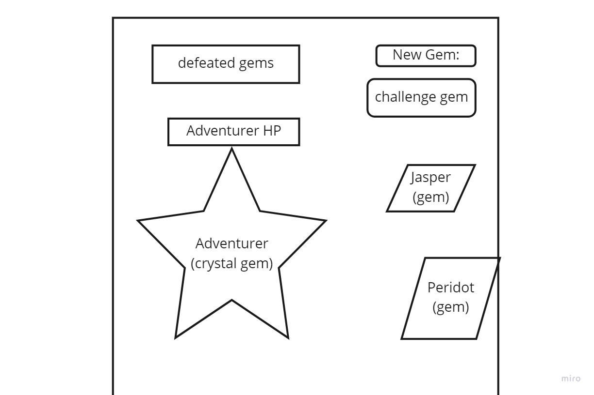

Plan

HTML
Slice 1 Adventurer
div adventurer stats

# p adveturer HP

Adventurer img

Slice 2 Goblin Gems

# input new gem

# button challenge gem

# button Gem (Jasper)

# button Gem (Peridot)

Functionality
render js
Create functionality for Goblin Gem attack button.

app js
create functionality for player HP
create clickhandler for goblingem.
If player hp < 0 functionality stops
if goblin hp < 0 functionality stops

create form event listener
generates new goblin gems when name is put into the input.

displayGoblins function to display goblins after inputted.
